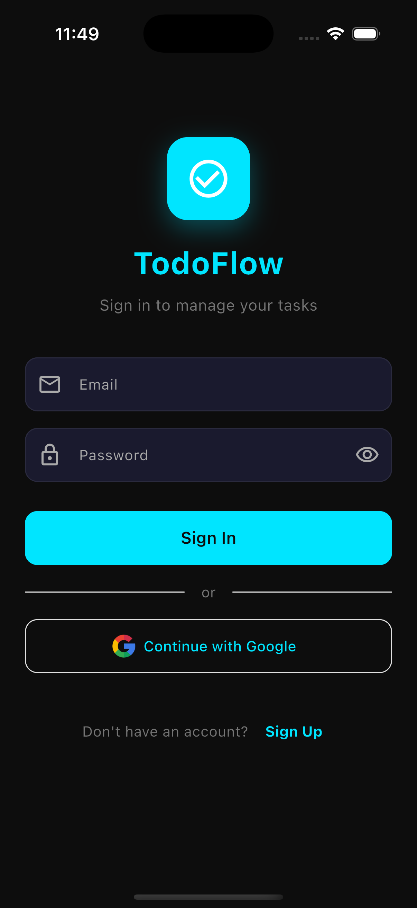
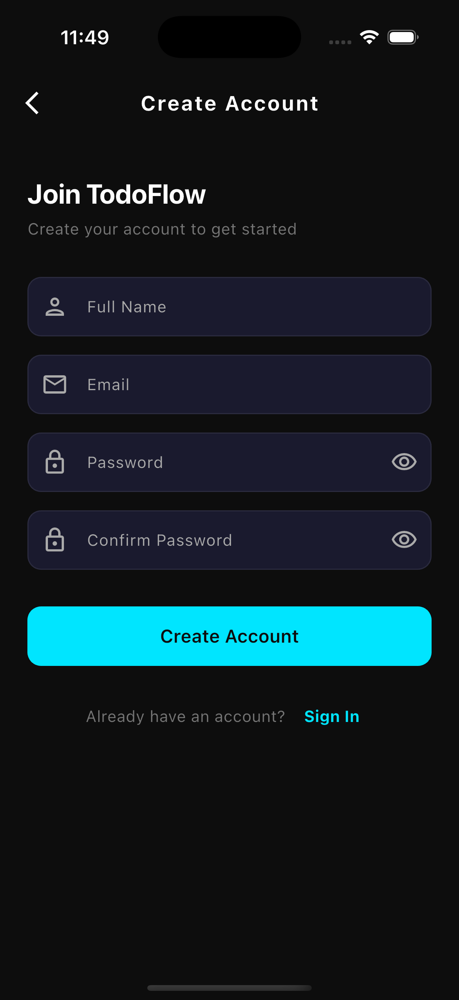
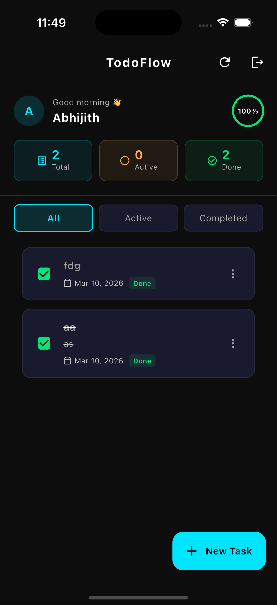

# 📝 TodoFlow App

A modern, clean, and scalable Todo application built using **Flutter**, powered by **Riverpod** for state management and structured with **Clean Architecture** principles.

---

## 📱 App Screens

<p align="center">
  
  
  
</p>

---

## 🚀 Features

* 🔐 Auth (Email + Google)
* 🆕 User Registration
* 📋 Task Dashboard
* ➕ Add / ✅ Complete Tasks
* 📊 Task Stats (Total / Active / Done)
* 🔄 Filters (All / Active / Completed)
* 🎯 Progress Indicator

---

## 🏗️ Architecture

This project follows **Clean Architecture** with proper separation of concerns:

```
lib/
 ├── core/            # Common utilities, themes, constants
 ├── data/            # Data sources, models, repositories (implementation)
 ├── domain/          # Entities, repository contracts, use cases
 ├── presentation/    # UI, widgets, screens, providers
```

### 🔁 State Management

* Uses **Riverpod** for reactive and scalable state handling
* Ensures testability and separation between UI and business logic

---

## 🎨 UI Highlights

* 🌙 Modern dark theme
* 🧩 Clean cards & rounded inputs
* ⚡ Smooth UX

---

## 🧪 Tech Stack

* **Flutter**
* **Dart**
* **Riverpod**
* **Clean Architecture**

---

## 🤝 Contributing

Contributions are welcome! Feel free to fork this repo and submit a PR.

---

## 📄 License

This project is licensed under the MIT License.

